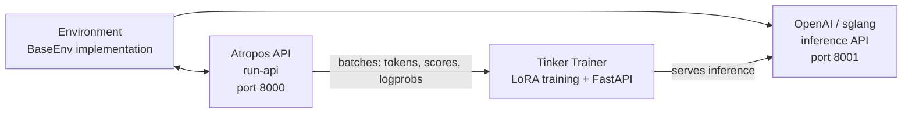

# RL 训练

Hermes Agent 包括建立在 **Tinker-Atropos** 基础上的集成 RL（强化学习）训练管道。这使用 GRPO（组相对策略优化）与 LoRA 适配器进行环境特定任务上的语言模型训练，完全通过 Agent 的工具界面编排。

## 概览

RL 训练系统由三个组件组成：

1. **Atropos** — 轨迹 API 服务器，协调环境交互、管理推广组和计算优势
2. **Tinker** — 训练服务处理模型权重、LoRA 训练、采样/推理和优化器步
3. **环境** — Python 类定义任务、评分和奖励函数（例如 GSM8K 数学问题）

Agent 可以发现环境、配置训练参数、启动训练运行和监视指标 — 全部通过一组 `rl_*` 工具。

## 要求

RL 训练需要：

- **Python >= 3.11**（Tinker 包要求）
- **TINKER_API_KEY** — Tinker 训练服务的 API 密钥
- **WANDB_API_KEY** — Weights & Biases 指标跟踪的 API 密钥
- `tinker-atropos` 子模块（在 Hermes 根相对的 `tinker-atropos/`）

```bash
# 设置 API 密钥
hermes config set TINKER_API_KEY your-tinker-key
hermes config set WANDB_API_KEY your-wandb-key
```

当两个密钥存在且 Python >= 3.11 可用时，`rl` 工具集自动启用。

## 可用工具

| 工具 | 描述 |
|------|-------------|
| `rl_list_environments` | 发现可用 RL 环境 |
| `rl_select_environment` | 选择环境并加载其配置 |
| `rl_get_current_config` | 查看可配置和锁定字段 |
| `rl_edit_config` | 修改可配置训练参数 |
| `rl_start_training` | 启动训练运行（生成 3 个进程） |
| `rl_check_status` | 监视训练进度和 WandB 指标 |
| `rl_stop_training` | 停止运行的训练作业 |
| `rl_get_results` | 获取最终指标和模型权重路径 |
| `rl_list_runs` | 列出所有活跃和完成的运行 |
| `rl_test_inference` | 使用 OpenRouter 的快速推理测试 |

## 工作流

### 1. 发现环境

```
列出可用的 RL 环境
```

Agent 调用 `rl_list_environments()` 扫描 `tinker-atropos/tinker_atropos/environments/` 使用 AST 解析以找到从 `BaseEnv` 继承的 Python 类。每个环境定义：

- **数据集加载** — 训练数据来自哪里（例如 HuggingFace 数据集）
- **提示构造** — 如何为模型格式化项
- **评分/验证** — 如何评估模型输出和分配奖励

### 2. 选择和配置

```
选择 GSM8K 环境并显示配置
```

Agent 调用 `rl_select_environment("gsm8k_tinker")`，然后 `rl_get_current_config()` 查看所有参数。

配置字段分为两类：

**可配置字段**（可以修改）：
- `group_size` — 每项完成数（默认：16）
- `batch_size` — 训练批大小（默认：128）
- `wandb_name` — WandB 运行名称（自动设置为 `{env}-{timestamp}`）
- 其他环境特定参数

**锁定字段**（基础设施设置，无法更改）：
- `tokenizer_name` — 模型分词器（例如 `Qwen/Qwen3-8B`）
- `rollout_server_url` — Atropos API URL (`http://localhost:8000`)
- `max_token_length` — 最大令牌长度（8192）
- `max_num_workers` — 最大并行工作线程（2048）
- `total_steps` — 总训练步数（2500）
- `lora_rank` — LoRA 适配器秩（32）
- `learning_rate` — 学习率（4e-5）
- `max_token_trainer_length` — 训练器的最大令牌（9000）

### 3. 启动训练

```
启动训练运行
```

Agent 调用 `rl_start_training()` 其中：

1. 生成 YAML 配置文件合并锁定设置与可配置覆盖
2. 创建唯一运行 ID
3. 生成三个进程：
   - **Atropos API 服务器** (`run-api`) — 轨迹协调
   - **Tinker 训练器** (`launch_training.py`) — LoRA 训练 + 端口 8001 上的 FastAPI 推理服务器
   - **环境** (`environment.py serve`) — 连接到 Atropos 的选定环境

进程以交错延迟启动（API 为 5s、训练器为 30s、环境后 90s 更多）以确保正确初始化顺序。

### 4. 监视进度

```
检查训练运行 abc12345 的状态
```

Agent 调用 `rl_check_status(run_id)` 其报告：

- 进程状态（每个 3 个进程的运行/退出）
- 运行时间
- WandB 指标（步、奖励均值、正确百分比、评估准确率）
- 用于调试的日志文件位置

:::note 速率限制
状态检查速率限制为每个运行 ID 每 **30 分钟**一次。这防止在需要数小时的长时间训练作业期间过度轮询。
:::

### 5. 停止或获取结果

```
停止训练运行
# 或
获取运行 abc12345 的最终结果
```

`rl_stop_training()` 以相反顺序终止所有三个进程（环境 → 训练器 → API）。`rl_get_results()` 检索最终 WandB 指标和训练历史。

## 推理测试

在提交到完整训练运行之前，你可以使用 `rl_test_inference` 测试环境是否正确工作。这运行几步推理和评分使用 OpenRouter — 无需 Tinker API，只需 `OPENROUTER_API_KEY`。

```
用推理测试选定的环境
```

默认配置：
- **3 步 × 16 完成 = 每个模型 48 推导**
- 测试 3 个不同规模的模型以确保鲁棒性：
  - `qwen/qwen3-8b`（小）
  - `z-ai/glm-4.7-flash`（中等）
  - `minimax/minimax-m2.7`（大）
- 总计：~144 推导

这验证：
- 环境正确加载
- 提示构造工作
- 推理响应解析在模型规模中很稳健
- 验证器/评分逻辑产生有效奖励

## Tinker API 集成

训练器使用 [Tinker](https://tinker.computer) API 进行模型训练操作：

- **ServiceClient** — 创建训练和采样客户端
- **训练客户端** — 使用重要性采样丢失、优化器步（Adam）和权重检查点处理前向反向通过
- **采样客户端** — 使用最新训练权重提供推理

训练循环：
1. 从 Atropos 获取推导批（提示 + 完成 + 分数）
2. 转换为 Tinker Datum 对象与填充对数概率和优势
3. 用重要性采样丢失运行前向反向通过
4. 取优化器步（Adam：lr=4e-5、β1=0.9、β2=0.95）
5. 保存权重并创建新采样客户端用于下一步推理
6. 记录指标到 WandB

## 架构图



## 创建自定义环境

要创建新的 RL 环境：

1. 在 `tinker-atropos/tinker_atropos/environments/` 中创建 Python 文件
2. 定义一个继承自 `BaseEnv` 的类
3. 实现所需方法：
   - `load_dataset()` — 加载训练数据
   - `get_next_item()` — 提供下一项给模型
   - `score_answer()` — 评分模型输出并分配奖励
   - `collect_trajectories()` — 收集和返回轨迹
4. 可选地定义继承自 `BaseEnvConfig` 的自定义配置类

研究现有 `gsm8k_tinker.py` 作为模板。Agent 可以帮助你创建新环境 — 它可以读取现有环境文件、检查 HuggingFace 数据集和编写新环境代码。

## WandB 指标

训练运行记录到 Weights & Biases 这些关键指标：

| 指标 | 描述 |
|--------|-------------|
| `train/loss` | 训练丢失（重要性采样） |
| `train/learning_rate` | 当前学习率 |
| `reward/mean` | 组上的均值奖励 |
| `logprobs/mean` | 均值参考对数概率 |
| `logprobs/mean_training` | 均值训练对数概率 |
| `logprobs/diff` | 对数概率漂移（参考 - 训练） |
| `advantages/mean` | 均值优势值 |
| `advantages/std` | 优势标准差 |

## 日志文件

每个训练运行在 `~/.hermes/logs/rl_training/` 中生成日志文件：

```
logs/
├── api_{run_id}.log        # Atropos API 服务器日志
├── trainer_{run_id}.log    # Tinker 训练器日志
├── env_{run_id}.log        # 环境进程日志
└── inference_tests/        # 推理测试结果
    ├── test_{env}_{model}.jsonl
    └── test_{env}_{model}.log
```

这些对调试训练失败或产生意外结果时无价。
